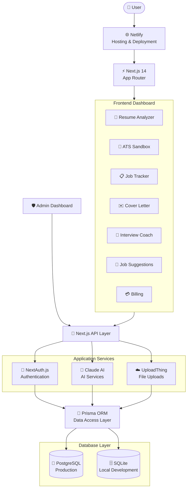
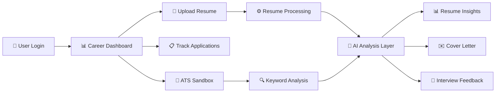

# 🚀 ResumeIQ — AI-Powered Resume Tracker

> A full-stack AI-powered career platform for resume analysis, job tracking, ATS optimization, and intelligent career assistance.

<p align="center">
  <a href="https://resumeiq-app-610.netlify.app/">
    
  </a>
</p>

<p align="center">
  
  
  
  
</p>

---

## 📌 Overview

**ResumeIQ** is a full-stack AI-powered career platform designed to simplify the job search workflow.

The application combines **resume analysis, ATS optimization, job application tracking, cover letter generation, and interview preparation** into a unified career dashboard.

🌐 **Live Application:** https://resumeiq-app-610.netlify.app/

---

## ✨ Features

| Feature | Description |
|---|---|
| 🤖 **AI Resume Analyzer** | Analyze resumes against job descriptions using AI |
| 📋 **Kanban Job Tracker** | Drag-and-drop application tracking across hiring stages |
| ✉️ **AI Cover Letters** | Generate personalized cover letters |
| 💼 **Job Suggestions** | Surface relevant career opportunities |
| 🧪 **ATS Sandbox** | Identify keyword gaps and improve ATS compatibility |
| 🎤 **AI Interview Coach** | Practice interview questions with AI feedback |
| 💳 **Billing Workflow** | Simulated subscription and payment workflow |
| 🛡️ **Admin Dashboard** | User, plan, and platform management |
| 🌙 **Dark Mode** | Responsive dark and light theme |

---

## 🏛️ System Architecture



---

## 🔄 Application Workflow



---

## 🏗️ Tech Stack

| Category | Technologies |
|---|---|
| **Framework** | Next.js 14 — App Router |
| **Language** | TypeScript |
| **Styling** | Tailwind CSS, Framer Motion |
| **Authentication** | NextAuth.js v5 |
| **Database** | Prisma ORM, SQLite, PostgreSQL |
| **AI Integration** | Anthropic Claude API |
| **File Uploads** | UploadThing |
| **Deployment** | Netlify |

---

## 📁 Project Structure

```text
app/
├── (auth)/
├── (dashboard)/
│   └── dashboard/
│       ├── admin/
│       ├── analyzer/
│       ├── billing/
│       ├── cover-letter/
│       ├── interviewer/
│       ├── jobs/
│       ├── resumes/
│       ├── sandbox/
│       ├── settings/
│       └── tracker/
│
├── api/
└── checkout/

components/
hooks/
lib/
prisma/
public/
types/
```

---

## 🚀 Getting Started

### Prerequisites

- Node.js 18+
- npm, yarn, or pnpm

### Clone Repository

```bash
git clone https://github.com/Mayank2014l/ai-powered-resume-tracker.git

cd ai-powered-resume-tracker
```

### Install Dependencies

```bash
npm install
```

### Configure Environment Variables

```bash
cp .env.example .env
```

Configure the required environment variables inside `.env`.

> ⚠️ Never commit API keys, database credentials, or production secrets.

### Setup Database

```bash
npx prisma generate
npx prisma db push
```

### Run Development Server

```bash
npm run dev
```

Open:

```text
http://localhost:3000
```

---

## 🌐 Live Deployment

ResumeIQ is deployed on **Netlify**.

🚀 **Live Demo:** https://resumeiq-app-610.netlify.app/

---

## 🔮 Future Improvements

- 📊 Advanced resume scoring models
- 🔗 Real-time job API integrations
- 📄 Resume version comparison
- 🧭 AI-powered career roadmap generation
- 📈 Detailed career analytics dashboards
- 🤖 Improved ATS optimization algorithms

---

## 📄 License

This project is licensed under the MIT License.

---

<p align="center">
  Built with ❤️ by <b>Mayank Pradhan</b>
</p>
